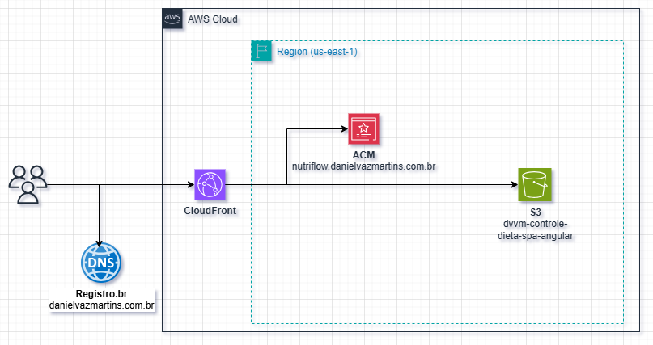

# Controle Dieta - Infraestrutura AWS

Infraestrutura como código (IaC) para hospedagem de uma Single Page Application (SPA) Angular na AWS usando Terraform.

## 📋 Descrição do Projeto

Este projeto provisiona automaticamente uma infraestrutura completa na AWS para hospedar uma aplicação web SPA (Single Page Application) com as seguintes características:

- **S3 Bucket**: Armazenamento estático dos arquivos da aplicação
- **CloudFront**: CDN global para distribuição rápida de conteúdo
- **ACM Certificate**: Certificado SSL para HTTPS
- **Configuração de DNS**: Validação automática via CNAME

## 🏗️ Arquitetura



```
Internet → CloudFront (CDN) → S3 Bucket (Static Website)
                    ↓
              ACM Certificate (SSL/TLS)
```

### Componentes Principais

- **S3 Bucket**: Hospeda os arquivos estáticos (HTML, CSS, JS)
- **CloudFront Distribution**: Distribui conteúdo globalmente com cache otimizado
- **ACM Certificate**: Fornece HTTPS seguro via SSL/TLS
- **DNS Validation**: Validação automática do certificado via CNAME

## 📁 Estrutura do Projeto

```
controle-dieta-infra/
├── terraform/
│   ├── acm.tf              # Certificado SSL ACM
│   ├── cloudfront.tf       # Distribuição CDN CloudFront
│   ├── data.tf             # Políticas IAM (bucket policy)
│   ├── main.tf             # Recursos S3 (bucket, website, policy)
│   ├── outputs.tf          # Outputs do Terraform
│   ├── provider.tf         # Configuração do provider AWS
│   ├── variables.tf        # Definição de variáveis
│   └── terraform.tfvars    # Valores das variáveis
├── README.md               # Esta documentação
└── LICENSE                 # Licença do projeto
```

## 🚀 Pré-requisitos

Antes de começar, você precisa ter instalado:

- [Terraform](https://www.terraform.io/downloads) (versão ~6.0)
- [AWS CLI](https://aws.amazon.com/cli/) configurado
- Conta AWS com permissões para:
  - Criar S3 buckets
  - Criar distribuições CloudFront
  - Solicitar certificados ACM
- Domínio registrado (ex: `danielvazmartins.com.br`)

## ⚙️ Configuração Inicial

### 1. Clone o repositório
```bash
git clone <url-do-repositorio>
cd controle-dieta-infra/terraform
```

### 2. Configure as credenciais AWS
```bash
aws configure
# Insira suas chaves de acesso da conta AWS
```

### 3. Personalize as variáveis
Edite o arquivo `terraform.tfvars`:

```hcl
bucket_name = "seu-bucket-unico-s3"
domain_name = "seudominio.com.br"
```

**Nota**: O `bucket_name` deve ser globalmente único na AWS.

## 🚀 Como Fazer Deploy

### Passo 1: Inicializar o Terraform
```bash
terraform init
```

### Passo 2: Planejar as mudanças
```bash
terraform plan
```

### Passo 3: Aplicar as mudanças
```bash
terraform apply
# Aplicar alterações automaticamente
terraform apply -auto-approve
```

Durante o `apply`, o Terraform irá:
1. Criar o certificado ACM
2. **Mostrar o CNAME necessário** para validação DNS
3. Aguardar validação automática

### Passo 4: Configurar DNS
Copie o CNAME mostrado no output e configure no seu provedor DNS:

```
Tipo: CNAME
Nome: _xxxxx.acm-validations.aws
Valor: _yyyyy.acm-validations.aws
```

### Passo 5: Fazer upload da aplicação
Após o deploy, faça upload dos arquivos da SPA para o S3:

```bash
aws s3 sync ../dist/ s3://seu-bucket-name/
```

## 📊 Outputs

Após o deploy bem-sucedido, o Terraform mostra:

- **certificate_validation_cname**: CNAME para validação do certificado
- **cloudfront_domain_name**: Domínio do CloudFront (ex: `d123456.cloudfront.net`)

## 🔧 Padrões Utilizados

### Terraform
- **Módulos**: Organização em arquivos `.tf` por recurso
- **Variáveis**: Configuração externalizada em `variables.tf` e `terraform.tfvars`
- **Outputs**: Exposição de informações importantes
- **Lifecycle**: `create_before_destroy` para certificados ACM

### AWS
- **Região**: `us-east-1` (obrigatório para CloudFront/ACM global)
- **Cache Policy**: `CachingOptimized` para SPAs
- **SSL**: Redirecionamento automático para HTTPS
- **S3**: Acesso público controlado via bucket policy

### Segurança
- **HTTPS Only**: CloudFront força HTTPS
- **Acesso Público**: S3 permite apenas leitura pública de objetos
- **Certificado**: Validação DNS automática

## 🛠️ Comandos Úteis

### Verificar estado dos recursos
```bash
terraform show
```

### Destruir infraestrutura
```bash
terraform destroy
```

### Validar configuração
```bash
terraform validate
```

### Formatar código
```bash
terraform fmt
```

## 🔍 Troubleshooting

### Erro: CNAMEAlreadyExists
- Solução: Remova distribuições CloudFront antigas ou mude o alias

### Erro: BucketAlreadyExists
- Solução: Escolha um nome de bucket único

### Certificado não valida
- Verifique se o CNAME foi configurado corretamente no DNS
- Aguarde propagação DNS (até 24h)

### Problemas de CORS
- Configure CORS no S3 se necessário:
```bash
aws s3api put-bucket-cors --bucket seu-bucket --cors-configuration file://cors.json
```

## 🤝 Como Contribuir

1. Fork o projeto
2. Crie uma branch para sua feature (`git checkout -b feature/nova-feature`)
3. Commit suas mudanças (`git commit -am 'Adiciona nova feature'`)
4. Push para a branch (`git push origin feature/nova-feature`)
5. Abra um Pull Request

## 📝 Licença

Este projeto está sob a licença MIT. Veja o arquivo [LICENSE](LICENSE) para mais detalhes.

## 📞 Suporte

Para dúvidas ou problemas:
- Abra uma issue no GitHub
- Verifique os logs do Terraform
- Consulte a documentação da AWS

---

## 📚 Referências

Documentação oficial dos recursos AWS utilizados:

- [AWS S3 Bucket](https://registry.terraform.io/providers/hashicorp/aws/latest/docs/resources/s3_bucket)
- [AWS S3 Bucket Website Configuration](https://registry.terraform.io/providers/hashicorp/aws/latest/docs/resources/s3_bucket_website_configuration)
- [AWS S3 Bucket Public Access Block](https://registry.terraform.io/providers/hashicorp/aws/latest/docs/resources/s3_bucket_public_access_block)
- [AWS S3 Bucket Policy](https://registry.terraform.io/providers/hashicorp/aws/latest/docs/resources/s3_bucket_policy)
- [AWS ACM Certificate](https://registry.terraform.io/providers/hashicorp/aws/latest/docs/resources/acm_certificate)
- [AWS ACM Certificate Validation](https://registry.terraform.io/providers/hashicorp/aws/latest/docs/resources/acm_certificate_validation)
- [AWS CloudFront Distribution](https://registry.terraform.io/providers/hashicorp/aws/latest/docs/resources/cloudfront_distribution)

---

**Nota**: Esta infraestrutura gera custos na AWS. Monitore seu uso via AWS Billing.